# Screening EOR 

## Teori Dasar Statistik, Distribusi Probabilitas, dan Metode Numerik 

### Teori Dasar Statistik dan Probabilitas 

```{r include=FALSE}
knitr::opts_chunk$set(echo = FALSE)
```

Statistik adalah ilmu yang mempelajari cara mengumpulkan, mengatur, menganalisis, dan menginterpretasi data. Statistik dibagi menjadi dua, yaitu statistik deskriptif dan statistik inferensial. Statistik deskriptif membahas mengenai cara mengumpulkan dan mengatur data, sedangkan statistik inferensial membahas mengenai cara menganalisis data, yaitu analisis terhadap data sampel untuk memberikan kesimpulan= mengenai populasi. Beberapa istilah yang digunakan dalam statistik, diantaranya:

1. __Populasi__, yaitu total data dari sistem yang ingin dipelajari. Variabel yang menggambarkan populasi disebut __parameter populasi__. Parameter populasi yang penting untuk diketahui diantaranya: (a) __Rata-rata (mean) populasi__ (dilambangkan $\mu$ ), yaitu parameter yang memberikan informasi mengenai titik pusat dari data populasi; (b) __*Variance* populasi__ (dilambangkan $\sigma$^2^, yaitu parameter yang memberikan informasi mengenai sebaran dat apopulasi. __Standard deviasi populasi__ (dilambangkan $\sigma$) didefinisikan sebagai akar kuadrat dari _variance_ populasi ($\sqrt{\sigma^2}$). Sama halnya dengan _variance_ populasi, standard deviasi populasi juga memberikan informasi mengenai sebaran data populasi.
2. __Sampel__, yaitu bagian dari populasi. Sampel harus dapat mewakili populasi. Sampel yang memenuhi kriteria ini disebut sebagai __*random* sampel__. Variabel yang menggambarkan sampel disebut __statistik sampel__. Statistik sampel yang penting untuk diketahui diantaranya: (a) __Rata-rata (*mean*) sampel__ (dilambangkan $\bar{x}$), yaitu statistik yang memberikan informasi mengenai titik pusat dari data sampel. _Mean_ sampel dihitung dengan menjumlahkan semua nilai numerik sampel, kemudian dibagi dengan jumlah anggota sampel; (b) __*Variance* sampel__ (dilambangkan s^2^), yaitu parameter yang memberikan informasi mengenai sebaran data sampel. __Standard deviasi sampel__ (dilambangkan __s__) didefinisikan sebagai akar kuadrat dari _variance_ sampel ($\sqrt{s^2}$). Sama halnya dengan _variance_ sampel, standard deviasi sampel memberikan informasi mengenai sebaran data sampel.

Dalam aplikasi, informasi mengenai parameter populasi seringkali tidak diketahui. Dalam kasus seperti ini, akan terlihat peranan penting dari statistik, yaitu kesimpulan mengenai populasi dapat dibuat melalui analisis sampel. Konsekuensi dari hal ini adalah terdapatnya ketidakpastian pada kesimpulan yang diperoleh. Adanya ketidakpastian _uncertainty_ dalam kesimpulan merupakan hal yang tidak dapat dipisahkan dari statistik.

Dalam probabilitas dikenal istilah event, yaitu suatu kejadian yang muncul sebagai akibat dari eksperimen. __Eksperimen__ didefinisikan sebagai suatu kegiatan yang dilakukan untuk memperoleh data atau nilai. Himpunan event keluaran (*output*) dari seluruh kemungkinan _event_ yang muncul sebagai hasil dari suatu eksperimen disebut sebagai himpunan semesta atau __ruang sampel__. Ruang sampel disimbolkan dengan _S_.

```{r fig.align = 'center', out.width = "50%", fig.cap = "Definisi ruang sampel dan anggota sampel"}
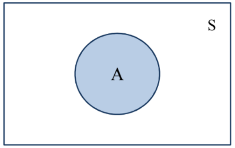
```

Gambar di atas memberikan ilustrasi mengenai konsep ruang sampel dan anggota sampel. Pada gambar, _event_ A merupakan anggota dari ruang sampel _S_. Konsep probabilitas erat kaitannya dengan konsep frekuensi relatif. Jika suatu eksperimen diulang sebanyak n kali, kemudian dicatat banyaknya jumlah keluaran dari _n_ jumlah eksperimen yang berupa _event A_, maka frekuensi dari _event A_, disimbolkan _N_(*A*), didefinisikan sebagai berikut. $$N(A)=\frac{banyaknya\ keluaran\ event\ A}{n}...(1)$$
Frekuensi relatif _event_ A dinyatakan sebagai frekuensi _event_ A dibagi banyaknya jumlah sampel _n_. $$frekuensi\ relatif\ (A)=\frac{N(A)}{n}...(2)$$
Nilai frekuensi relatif suatu _event_ bergantung pada jumlah sampel n. Semakin banyak n, maka nilai frekuensi relatif akan semakin stabil. Probabilitas suatu _event_ bersesuaian dengan nilai stabil dari frekuensi relatif _event_ tersebut. __Probabilitas suatu _event_ didefinisikan sebagai proporsi kemunculan suatu _event_ dari total _n_ jumlah random eksperimen__. Probabilitas kemunculan atau kejadian suatu _event_ disimbolkan P(*event*). Maka, probabilitas kejadian _event_ A dalam ruang sampel S disimbolkan dengan P(A). Dua aturan dasar terkait teori probabilitas adalah probabilitas suatu _event_ tidak pernah bernilai negatif, dan probabilitas dari ruang sampel _S_ adalah 1.
<p>&nbsp;</p>

#### Distribusi Probabilitas Kontinu 

Seperti yang telah dijelaskan sebelumnya, probabilitas dapat didefinisikan sebagai peluang terjadinya suatu _event_ atau peluang kemunculan suatu nilai dari suatu eksperimen. Eksperimen yang dimaksud di sini adalah ___ekperimen statistik___, yaitu suatu proses yang menghasilkan data atau nilai numerik. Nilai probabilitas berada diantara 0 dan 1. Jika terdapat sekumpulan nilai, dan masing-masing nilai tersebut dikaitkan dengan probabilitas kejadiannya, maka akan diperoleh distribusi probabilitas.

Distribusi probabilitas dapat dibagi menjadi dua, yaitu distribusi probabilitas diskrit dan distribusi probabilitas kontinu. Fungsi yang menjelaskan suatu distribusi probabilitas dari variabel random diskrit disebut sebagai ___probability mass function___, sedangkan fungsi yang menjelaskan suatu distribusi probabilitas dari variabel random kontinu disebut sebagai ___probability density function___. Karena parameter reservoir merupakan variable random kontinu, maka penjelasan akan ditekankan pada teori _probability density function_.

_Probability Density Funtion_ (disingkat PDF) adalah suatu fungsi f(x) yang memberikan bentuk distribusi probabilitas dari suatu variabel random kontinu. Konsep PDF sangat penting karena dengan mengetahui PDF dari suatu parameter, maka bentuk distribusi probabilitas dari parameter tersebut akan dapat diketahui. Misalkan, untuk parameter porositas reservoir, dengan mengetahui PDF dari porositas reservoir maka bentuk distribusi dari porositas akan diketahui. Secara matematis, PDF didefinisikan oleh persamaan berikut.$$P(a<X<b)=\int_a^{b}f(x)dx$$
Beberapa sifat dari PDF adalah sebagai berikut:

1. f(x) > 0, x $\in$ S. Maksud dari simbol ini adalah PDF _f_ selalu bernilai positif, dimana variabel random _x_ merupakan anggota dari ruang sampel _S_.
2. $\int_s f(x)dx=1$. Maksudnya adalah total luas daerah di bawah kurva PDF selalu sama dengan 1, artinya nilai probabilitas total (untuk seluruh anggota ruang sampel _S_) adalah 1.

Informasi PDF dapat digunakan untuk mencari nilai rata-rata ($\mu$) dan _variance_ ($\sigma^2$) dari PDF tersebut. Nilai rata-rata ($\mu$) dan _variance_ ($\sigma^2$) dapat dihitung menggunakan persamaan berikut.$$\mu=\int_s xf(x)dx$$ $$\sigma^2=\int_s (x-\mu)^2f(x)dx=\int_s x^2f(x)dx-\mu^2...(3)$$
Terdapat beberapa bentuk distribusi kontinu yang akan digunakan dalam analisis EOR _screening._ Berikut akan dijelaskan empat bentuk distribusi kontinu yang akan digunakan dalam algoritma EOR _screening_. 
<p>&nbsp;</p>

#### Distribusi Normal dan Standard Normal

__Distribusi normal__ (disebut juga __distribusi *Gaussian*__) merupakan distribusi dari variabel random kontinu yang berbentuk mirip lonceng (“*bell-shaped*”). Distribusi normal didefinisikan oleh dua parameter, yaitu nilai rata-rata ($\mu$) dan standard deviasi ($\sigma$).

```{r fig.align = 'center', out.width = "50%", fig.cap = "Bentuk distribusi normal"}
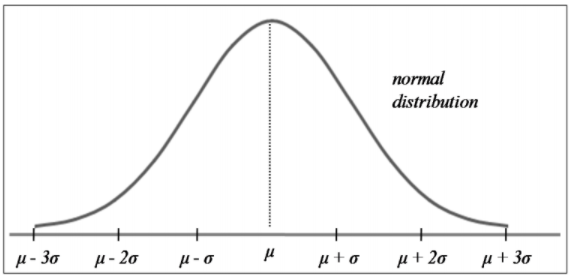
```

Beberapa sifat dari distribusi normal adalah:
1. Kurva distribusi normal berbentuk mirip lonceng (“_bell-shape_d”) dengan titik puncak kurva berada di atas nilai rata-rata ($\mu$),
2. Kurva distribusi normal berbentuk simetri melalui nilai rata-rata ($\mu$), dan
3. Kurva distribusi normal semakin mendekati sumbu horizontal namun tidak pernah menyentuh atau melewati sumbu horizontal.

Hal yang terpenting dari kurva distribusi normal adalah luas daerah di bawah kurva distribusi normal. Hal ini penting karena luas daerah di bawah kurva distribusi normal pada suatu interval tertentu menyatakan __probabilitas__ suatu nilai berada pada interval tersebut. Sama seperti aturan distribusi probabilitas untuk semua distribusi probabilitas kontinu yang telah dijelaskan sebelumnya, total luas daerah di bawah kurva distribusi normal adalah 1. Gambar berikut memperlihatkan konsep ini.

```{r fig.align = 'center', out.width = "50%", fig.cap = "Total luas daerah di bawah kurva distribusi normal adalah 1"}
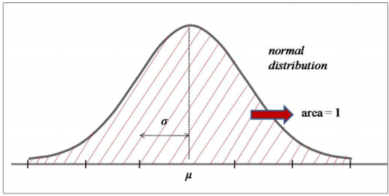
```

```{r fig.align = 'center', out.width = "50%", fig.cap = "Total luas daerah setengah dari total distribusi normal adalah 0.5"}
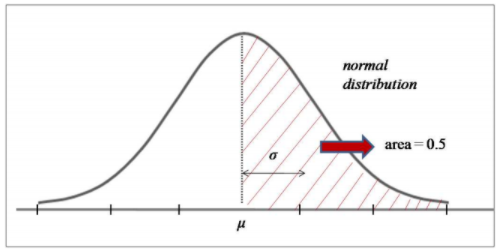
```

Maka, dengan mengetahui luas daerah di bawah kurva distribusi normal dalam suatu interval, probabilitas suatu nilai ada di dalam interval tersebut dapat diketahui. Hal lain yang perlu diketahui dari kurva distribusi normal adalah sebagai berikut:

1. Sekitar 68.2% dari luas daerah di bawah kurva distribusi normal berada dalam interval satu
standard deviasi dari nilai rata-ratanya, yaitu $\mu$ + $\sigma$ dan $\mu$ – $\sigma$,
2. Sekitar 95.4% dari luas daerah di bawah kurva distribusi normal berada dalam interval dua
standard deviasi dari nilai rata-ratanya, yaitu $\mu$ + 2$\sigma$ dan $\mu$ – 2$\sigma$, dan
3. Sekitar 99.7% dari luas daerah di bawah kurva distribusi normal berada dalam interval tiga
standard deviasi dari nilai rata-ratanya, yaitu $\mu$ + 3$\sigma$ dan $\mu$ – 3$\sigma$.

Dengan kata lain, suatu nilai yang merupakan anggota dari populasi nilai distribusi normal yang bersangkutan akan berada pada _range_ ± 3 standard deviasi dari _mean_ $\mu$. Karena hampir seluruh nilai yang merupakan anggota populasi berada pada _range_ ± 3 standard deviasi dari μ (dengan probabilitas 99.7%), maka dapat disimpulkan bahwa suatu nilai yang berada di luar _range_ ± 3 standard deviasi dari $\mu$ bukan merupakan anggota dari populasi yang bersangkutan (probabilitas nilai ini merupakan anggota dari populasi terkait sangat kecil, yaitu 100% - 99.7% = 0.3%).

```{r fig.align = 'center', out.width = "50%", fig.cap = "Luas daerah (probabilitas) di bawah kurva distribusi normal untuk masing-masing range standard deviasi dari mean"}
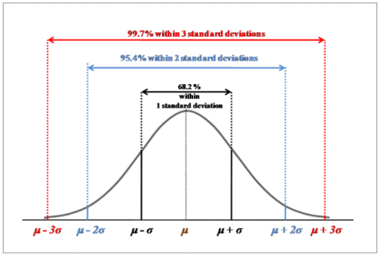
```
_
Probability Density Function_ (PDF) distribusi normal diberikan oleh persamaan berikut. $$f(x)=\frac{1}{\sigma\sqrt{2\pi}}e^{-\frac{(x-\mu)^2}{2\sigma^2}}...(4)$$

Menentukan luas daerah di bawah kurva distribusi normal tidaklah selalu mudah karena masing- masing distribusi normal memiliki nilai rata-rata $\mu$ dan standard deviasi $\sigma$ yang berbeda satu sama lain. Oleh karena itu, digunakanlah teori __distribusi standard normal__ untuk mempermudah menghitung luas daerah di bawah kurva distribusi normal. Prosedur dalam menentukan luas daerah di bawah kurva normal adalah mentransformasi nilai _x_ pada distribusi normal original menjadi nilai _z_ pada distribusi standard normal. Statistik _z_ disebut sebagai statistik standard normal, yaitu suatu parameter yang mengkarakterisasi nilai distribusi standard normal. Kemudian, luas daerah di bawah kurva standard normal ditentukan dengan melihat tabel luas daerah kurva standard normal yang telah disusun oleh para ahli statistik.
s
Konsep untuk mentransformasi kurva distribusi normal menjadi kurva standard normal adalah dengan menghitung berapa standard deviasi jauhnya suatu nilai x pada distribusi normal dari _mean_-nya. Setelah hal ini diketahui, maka nilai _x_ dikonversi menjadi nilai _z_ menggunakan persamaan berikut. $$z=\frac{x-\mu}{\sigma}...(5)$$

Distribusi normal _original_ kini telah ditransformasi ke dalam distribusi standard normal dengan variabel _z_. Distribusi standard normal dicirikan dengan nilai rata-rata $\mu$ = 0 dan standard deviasi $\sigma$ = 1. Luas daerah (probabilitas) suatu nilai standard normal akan jatuh pada interval 0 dan _z_ diperoleh dari kurva standard normal. Distribusi standard normal sangat berguna karena dapat mempermudah perhitungan probabilitas suatu nilai dalam distribusi normal.
<p> &nbsp; </p>

#### Distribusi Segitiga (Triangular)

Distribusi segitiga merupakan bentuk distribusi kontinu yang dikarakterisasi oleh tiga titik, yaitu titik ujung bawah a, titik ujung atas b, dan titik tengah c, dimana a < b dan a ≤ c ≤ b.

```{r fig.align = 'center', out.width = "50%", fig.cap = "Distribusi segitiga"}
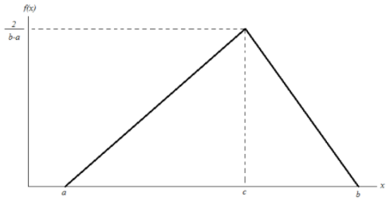
```
_Probability Density Function_ (PDF) untuk distribusi segitiga diberikan oleh:

$$
f(x) =
\begin{cases}
  0,\ untuk\ x < a\ dan\ x > b\\ 
  \frac{2(x-a)}{(b-a)(c-a)},\ untuk\ a \leq x \leq c \\
  \frac{2(b-x)}{(b-a)(b-c)},\ untuk\ c \leq x \leq b
\end{cases}       
$$
<p> &nbsp; </p>

#### Distribusi Uniform 

Distribusi _uniform_ kontinu adalah bentuk distribusi dimana setiap anggota distribusi memiliki probabilitas kemunculan yang sama. Bentuk distribusi ini dicirikan oleh dua parameter, yaitu nilai minimum _a_, dan nilai maksimum _b_. _Probability Density Function_ (PDF) dari distribusi _uniform_ adalah:

$$
f(x)=
\begin{cases}
  \frac{1}{b-a},\ untuk\ a \leq x \leq b\\
  0,\ untuk\ x > a\ atau\ x > b
\end{cases}
$$
```{r fig.align = 'center', out.width = "50%", fig.cap = "Distribusi uniform"}
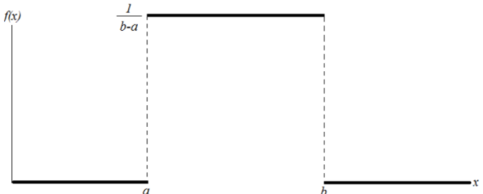
```
<p> &nbsp; </p>

#### Distribusi Log Normal

Distribusi log normal berkaitan dengan distribusi normal, sehingga parameter-parameter distribusi log normal dapat dinyatakan dalam bentuk parameter distribusi normal. Misalkan Y adalah suatu variabel random kontinu yang terdistribusi normal, maka variabel random kontinu  = D akan terdistribusi log normal dengan:

<center> _Mean_ log normal = E[ln(X)] = E(Y) = $\mu$ </center>
<center> _Variance_ log normal = Var[ln(X)] = Var[Y] = $\sigma$^2^ </center>
<center> dimana ln(X) = ln(e^Y^) = Y </center>
<p> &nbsp; </p>

Bentuk distribusi log normal adalah seperti distribusi normal namun miring ke kiri. Hal ini disebabkan karena distribusi normal memiliki _skewness_ nol, sedangkan distribusi log normal memiliki _skewness_ positif.
```{r fig.align = 'center', out.width = "50%", fig.cap = "Distribusi log normal"}
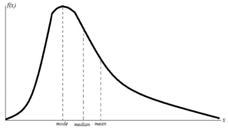
```
_Mean_ dan _variance_ dari variabel log normal _X_ adalah:
$$\mu_X = e^{(\mu+\frac{\sigma^2}{2})}$$
$$\sigma^2_X = (e^{2\mu+\sigma^2})(e^{\sigma^2}-1$$
Dimana $\mu$ dan $\sigma$^2^ adalah _mean_ dan _variance_ dari variabel normal _Y_. Terlihat bahwa _mean_ dan _variance_ dari variabel log normal adalah fungsi dari _mean_ dan _variance_ variabel normal. Karenadistribusi log normal dan distribusi normal saling berkaitan, maka _Probability Density Function_ (PDF) dari distribusi log normal dinyatakan oleh parameter-parameter distribusi normal.
$$f(x) = \frac{1}{x\sigma\sqrt{2\pi}}\ exp\ [-\frac{1}{2\sigma^2}(ln\ x-\mu)^2]$$
Pada persamaan (8) di atas, $\mu$ dan $\sigma$^2^ adalah _mean_ dan _variance_ dari variabel normal _Y_.

### Metode Numerik

Dalam aplikasi, seringkali dijumpai permasalahan berupa penentuan akar (solusi) dari sebuah persamaan _f(x)_ = 0. Jika _f(x)_ adalah suatu fungsi sederhana, tentu solusinya akan mudah diperoleh secara eksak. Permasalahan timbul apabila fungsi _f(x)_ adalah suatu fungsi kompleks yang solusinya tidak dapat diperoleh secara eksak. Untuk kasus-kasus dimana solusi dari fungsi _f(x)_ tidak dapat diperoleh secara eksak, dilakukan pendekatan pencarian solusi secara numerik, yaitu dilakukan perubahan solusi secara bertahap dengan sedikit demi sedikit menambah tingkat ketelitian sampai diperoleh solusi dengan tingkat ketelitian yang diinginkan. Metode mencarisolusi seperti ini disebut sebagai __metode approksimasi berurutan *(method of successive approximation)*__ atau disebut juga dengan __metode iterasi__. Metode iterasi tidak hanya harus diterapkan pada kasus-kasus yang tidak memiliki solusi eksak. Kasus-kasus sederhana yang solusi eksaknya ada pun dapat dicari pendekatan solusinya menggunakan metode iterasi. Bahkan, metode iterasi lebih disukai untuk digunakan di kasus-kasus sederhana oleh banyak orang karena metode ini kadang lebih mudah diterapkan dibandingkan mencari solusi eksak secara analitik.

Terdapat beberapa metode iterasi yang dapat digunakan untuk mencari solusi. Pada penelitian ini, metode iterasi yang digunakan adalah metode Newton-Raphson. Oleh karena itu, pada subbab ini, penjelasan metode numerik dibatasi pada metode Newton-Raphson.

__Metode Newton-Raphson__, yang juga sering disebut sebagai __metode Newton__ adalah suatu metode numerik yang melibatkan turunan pertama dari fungsi _f(x)_ dalam proses iterasi. Pada penelitian ini, metode Newton digunakan untuk mencari titik potong antara dua kurva distribusi, yaitu kurva distribusi _database_ dan kurva distribusi _input_. Jika distribusi _database_ memiliki _density function_ _f(x)_ dan distribusi _input_ memiliki _density function_ _g(x)_, maka fungsi _h(x)_ = _f(x)_ - _g(x)_ menyatakan selisih antara _density database_ dengan _density input_. Nilai fungsi _h(x)_ = 0 menyatakan titik potong antara kedua kurva _f(x)_ dan _g(x)_. Metode Newton diterapkan terhadap fungsi _h(x)_ untuk mencari pendekatan solusi _h(x)_ = 0. Hasil dari penerapan metode Newton adalah diperolehnya pendekatan nilai x dimana _h(x)_ sangat dekat ke nol. Nilai x ini merupakan titik potong yang dicari.
```{r fig.align = 'center', out.width = "50%", fig.cap = "Titik x~p~ merupakan titik potong antara kurva distribusi database dengan kurva distribusi input. Titik potong ini dicari menggunakan metode Newton-Rhapson"}
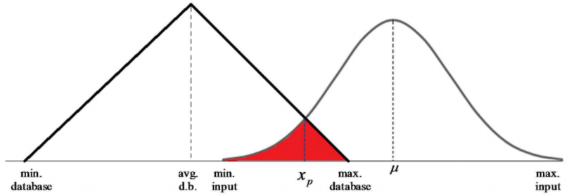
```
Misalkan _h(x)_ adalah fungsi yang dapat didiferensialkan dan misalkan x~1~ adalah tebakan awal solusi untuk _h(x)_ = 0. Jika E melambangkan batas toleransi error dari solusi, maka metode Newton diterapkan dengan mengulangi langkah berikut untuk n = 1, 2 ... sampai diperoleh |x~n+1~ - x~n~| < _E_:
$$x_{n+1} = x_n - \frac{h(x_n)}{h'(x_n)}...(9)$$
Persamaan (9) di atas merupakan prosedur perulangan (iterasi) untuk mencari solusi x yang sangat mendekati _h(x)_ = 0. Prosedur iterasi dilakukan sampai dicapai suatu nilai konvergen (yang kemudian diambil sebagai solusi), atau sampai suatu batas _error_ tertentu _E_, dimana _E_ = |x~n+1~ - x~n~| Hal yang perlu diperhatikan dalam penggunaan metode Newton-Raphson adalah pemilihan tebakan awal untuk solusi. Permasalahan yang sering timbul adalah pemilihan tebakan awal yang terlalu jauh sehingga kekonvergenan lambat diperoleh, atau bahkan solusi konvergen tidak dapat diperoleh.

Setelah titik potong dari dua kurva distribusi diperoleh dari metode Newton, maka langkah selanjutnya adalah mencari luas daerah irisan dari kedua kurva distribusi tersebut (arsiran merah pada Gambar 9). Luas daerah irisan ini menyatakan probabilitas kecocokan distribusi _input_ terhadap distribusi _database_.

Penentuan luas daerah irisan melibatkan penggunaan integral dari fungsi distribusi dalam suatu interval [*a*, *b*]. Metode numerik yang digunakan dalam penentuan luas daerah (integral) adalah __metode Simpson__ (disebut juga __metode Parabolik__). Metode Simpson mencari pendekatan terhadap luas daerah dari suatu bangun ruang dengan membagi interval [*a*, *b*] ke dalam n jumlah sub-interval (*n* harus genap), dimana pada masing-masing sub-interval ditempatkan suatu bangun ruang parabola. Sehingga, akan terdapat *n* buah parabola di bawah suatu kurva *f(x)*. Luas daerah di bawah kurva *f(x)* dapat didekati dengan menjumlahkan seluruh n buah parabola dalam interval [*a*, *b*].

Metode Simpson dinyatakan sebagai berikut.
$$\int_a^bf(x)dx \approx \frac{h}{3}[f(x_0)+4f(x_1)+2f(x_2)+...+4f(x_{n-1})+f(x_n)]...(10)$$
Pada persamaan (10) di atas, h adalah lebar sub-interval dan nilai-nilai 1, 4, 2, 4, 2, 4, 2,..., 2, 4, 1 adalah koefisien-koefisien yang terkait dengan setiap suku _f(x)_.
<p> &nbsp; </p>

## Metode Analisis EOR Screening

Teori dasar yang telah dijelaskan di subbab pertamaS merupakan dasar yang akan digunakan untuk analisis EOR _screening_ dalam subbab ini. Seperti yang telah disebutkan pada bagian pendahuluan, analisis dilakukan untuk mengetahui probabilitas kecocokan dari setiap parameter _input_ reservoir (untuk setiap metode EOR) terhadap _database_. _Database_ ini berupa interval nilai parameter reservoir untuk setiap metode EOR yang telah berhasil diterapkan di seluruh dunia. _Database_ yang digunakan diambil dari paper Aladasani dan Baojun Bai (2010). Tabel berikut memperlihatkan _database_ yang digunakan untuk EOR _screening_.

```{r fig.align = 'center', out.width = "100%"}
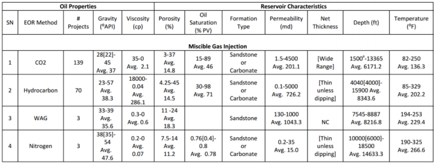
```
```{r fig.align = 'center', out.width = "100%"}
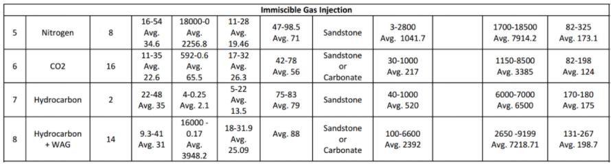
```
```{r fig.align = 'center', out.width = "100%"}
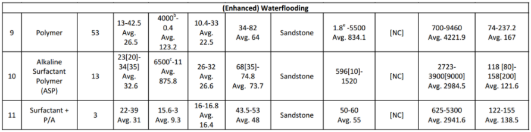
```
```{r fig.align = 'center', out.width = "100%"}
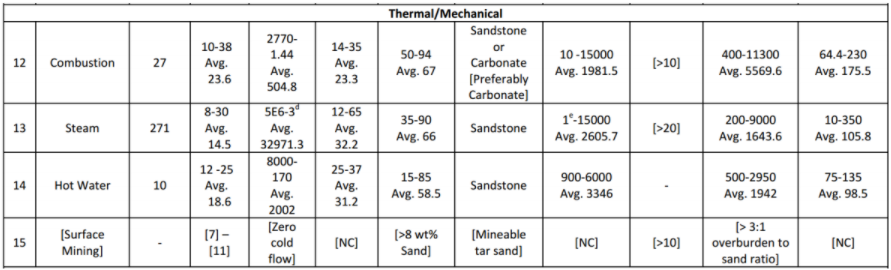
```
```{r fig.align = 'center', out.width = "100%", fig.cap = "_Range_ nilai dari beberapa parameter reservoir terhadap setiap metode EOR yang telah sukses diterapkan di beberapa tempat di seluruh dunia. _Range_ nilai ini akan dijadikan data acuan dalam analisis statistik. (Sumber: Ahmad Aladasani nad Baojun Bai, 2010, _Recent Developments and Updated Screening Criteria of Enhanced Oil Recovery Techniques_, SPE Paper 130726)"}
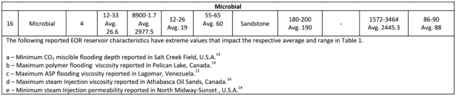
```

Interval nilai parameter reservoir yang tertera di Gambar 10 akan digunakan sebagai acuan _database_ dalam analisis. Metode analisis EOR _screening_ terbagi atas __metode analisis untuk *input* data *single-value*__ dan __metode analisis untuk *input* data distribusi__. Berikut akan dijelaskan kedua metode analisis ini.

### Metode Analisis EOR Screening Untuk Input Data Single-Value

_Input_ data _single-value_ yang dimaksud di sini adalah parameter _input_ berupa nilai tunggal, misalnya _input_ porositas berupa satu nilai porositas yang mewakili distribusi porositas. Terdapat dua algoritma yang digunakan dalam EOR _screening_, yaitu algoritma normal dan algoritma _tight_. Bentuk distribusi probabilitas yang digunakan dalam analisis input data single value adalah distribusi segitiga.

#### Algoritma Normal (Normal Screening Algorithm)

Algoritma normal yang digunakan dalam EOR screening dibagi menjadi dua, yaitu __algoritma statistik (*statistics algorithm*)__ dan __algoritma teknik (*engineering algorithm*)__. Algoritma statistik adalah algoritma yang murni menggunakan konsep statistik dalam penentuan kriteria *screen*ing, sedangkan algoritma teknik adalah algoritma yang menyertakan faktor *engineering sense* ke dalam perhitungan *screening*.

Pada kedua algoritma, disertakan parameter __*cut-off*__. Parameter *cut-off* menyatakan tambahan data (berupa luas daerah) sebesar ±$\alpha$% dari distribusi data original. Parameter ini memungkinkan *user* untuk menentukan nilai probabilitas (sebesar $\alpha$%) saat parameter input _x_ tepat jatuh di nilai maksimum atau nilai minimum *database*.
```{r fig.align = 'center', out.width = "50%", fig.cap="Konsep _cut-off_ dalam algoritma EOR _screening_"}
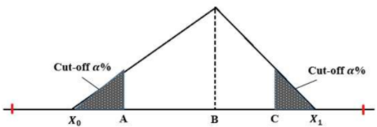
```
<p> &nbsp; </p>

__a.    Algoritma Statistik (Statistics Algoritm)__ <br/>
Pada algoritma statistik, nilai rata-rata (_mean_) dari distribusi _database_ digunakan sebagai acuan penentuan kecocokan 100% terhadap suatu metode EOR.
```{r fig.align = 'center', out.width = "50%", fig.cap="Konsep algoritma statistik"}
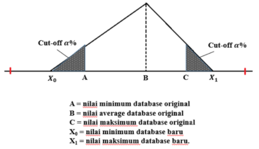
```
Berdasarkan _database_, maka variable yang diketahui nilainya adalah A, B, dan C (mengacu pada gambar di atas). X~0~ dan X~1~ merupakan dua variabel _unknown_ yang harus dicari nilainya. Penentuan nilai X~0~ adalah sebagai berikut.
```{r fig.align = 'center', out.width = "50%", fig.cap="Konsep penentuan __X~0~__"}
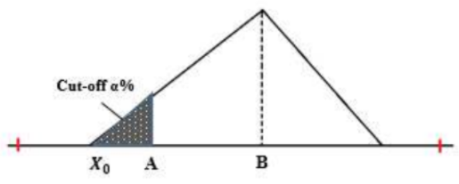
```
$$X_0 = \frac{-b\ ±\ \sqrt{D} }{2a}...(11)$$
Dimana: <br/> 
D = b^2^ - 4a <br/>
a = 1 - 2P <br/>
b = 4BP - 2A <br/>
c = A^2^ - 2PB^2^ <br/>
A = nilai minimum dari _database original_ <br/>
B = nilai rata-rata (*mean*) dari _database original_ <br/>
P = probabilitas nilai di x = _A_ (nyatakan P = $\frac{\alpha}{100}$). <br/>
Solusi X~0~ yang dipilih adalah yang memenuhi X~0~ < A

Penentuan nilai X~1~ adalah sebagai berikut.
```{r fig.align = 'center', out.width = "50%", fig.cap="Konsep penentuan __X~1~__"}
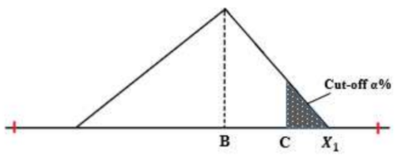
```
$$X_1 = \frac{-b\ ±\ \sqrt{D} }{2a}...(12)$$
Dimana: <br/> 
D = b^2^ - 4a <br/>
a = 1 - 2P <br/>
b = 4BP - 2C <br/>
c = C^2^ - 2PB^2^ <br/>
A = nilai maksimum dari _database original_ <br/>
B = nilai rata-rata (*mean*) dari _database original_ <br/>
P = probabilitas nilai di x = _C_ (nyatakan P = $\frac{\alpha}{100}$). <br/>
Solusi X~1~ yang dipilih adalah yang memenuhi X~1~ > A

Setelah nilai X~0~ dan X~1~ diperoleh, maka langkah selanjutnya adalah menentukan probabilitas kecocokan. Probabilitas kecocokan suatu parameter input *x* terhadap _database_ (dinyatakan oleh P(*x*) adalah sebagai berikut.

- Untuk parameter _input_ di bawah nilai _mean_ dari _database original_ (x < B)
```{r fig.align = 'center', out.width = "50%", fig.cap="Perhitungan P(x) untuk nilai input x < B"}
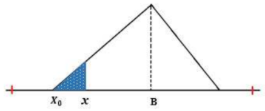
```
$$P(x) = \left( \frac{1}{2}\frac{(x-X_0)^2}{(B-X_0)^2} \right) \times 2\  ...(13)$$
Dimana: <br/> 
_x_ = nilai parameter _input single value_ <br/>
_X~0~_ = nilai minimum _database_ baru <br/>
_B_ = nilai _mean database original_ <br/>

- Untuk parameter _input_ di bawah nilai _mean_ dari _database original_ (x > B)
```{r fig.align = 'center', out.width = "50%", fig.cap="Perhitungan P(x) untuk nilai input x > B"}
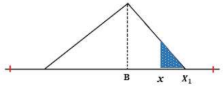
```
$$P(x) = \left( \frac{1}{2}\frac{(X_0-x)^2}{(X_1-B)^2} \right) \times 2\  ...(14)$$
Dimana: <br/> 
_x_ = nilai parameter _input single value_ <br/>
_X~1~_ = nilai maksimum _database_ baru <br/>
_B_ = nilai _mean database original_ <br/>
<p> &nbsp; </p>

__b.    Algoritma Teknik (Engineering Algoritm)__ <br/>
Pada algoritma teknik, terdapat tiga tipe algoritma yang dapat dipilih oleh _user_, yaitu algoritma tipe _average_, algoritma tipe maksimum, dan algoritma tipe minimum.
<p> &nbsp; </p>

__(1)   Algoritma Teknik Tipe _Average___ <br/>
Algoritma tipe ini adalah algoritma yang sama dengan yang diterapkan pada algoritma statistik, dimana mean dari _database_ dijadikan titik acuan penentuan kecocokan 100%.
```{r fig.align = 'center', out.width = "50%", fig.cap="Konsep algoritma teknik tipe _average_"}
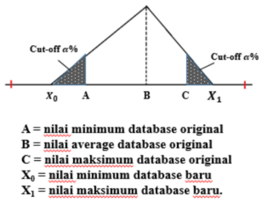
```
<p> &nbsp; </p>

__(2)   Algoritma Teknik Tipe Minimum__ <br/>
Algoritma tipe ini menetapkan nilai kecocokan 100% untuk nilai parameter _input_ di bawah nilai _mean database original_. Bentuk distribusi data yang digunakan adalah sebagai berikut.
```{r fig.align = 'center', out.width = "50%", fig.cap="Konsep algoritma teknik tipe minimum"}
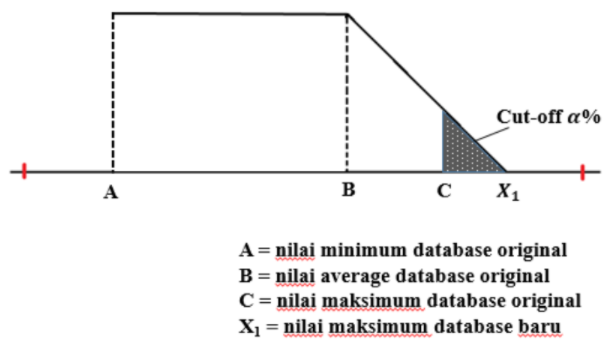
```
Langkah pertama dari algoritma adalah mencari nilai X~1~. Nilai X~1~ ditentukan sebagai berikut.
$$X_1 = \frac{-b\ ±\ \sqrt{D} }{2a}...(15)$$
Dimana: <br/> 
D = b^2^ - 4a <br/>
a = 1 - P <br/>
b = 4BP - 2C <br/>
c = C^2^ - 2PB^2^ <br/>
A = nilai maksimum dari _database original_ <br/>
B = nilai rata-rata (*mean*) dari _database original_ <br/>
P = probabilitas nilai di x = _C_ (nyatakan P = $\frac{\alpha}{100}$). <br/>
Solusi X~1~ yang dipilih adalah yang memenuhi X~1~ > C

Setelah nilai X~1~ diperoleh, maka langkah selanjutnya adalah menentukan probabilitas kecocokan. Probabilitas kecocokan suatu parameter input _x_ terhadap _database_ (dinyatakan oleh P(*x*)) adalah sebagai berikut.

- Untuk parameter _input_ di atas nilai _mean_ dari _database original_ (x > B)
```{r fig.align = 'center', out.width = "50%", fig.cap="Perhitungan P(x) untuk nilai input x > B"}
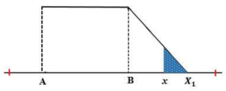
```
$$P(x) = \left[\frac{(X_1-x)^2}{(X_1-B)^2} \right]...(16)$$
<p> &nbsp; </p>

- Untuk parameter _input_ di bawah nilai _mean_ dari _database original_ (x < B)
```{r fig.align = 'center', out.width = "50%", fig.cap="Perhitungan P(x) untuk nilai input x < B"}
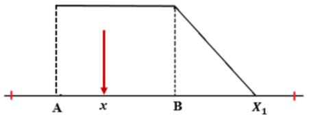
```
$$P(x) = 1...(17)$$
<p> &nbsp; </p>

__(3)   Algoritma Teknik Tipe Maksimum__ <br/>
Algoritma tipe ini menetapkan nilai kecocokan 100% untuk nilai parameter _input_ di atas nilai _mean database original_. Bentuk distribusi data yang digunakan adalah sebagai berikut.
```{r fig.align = 'center', out.width = "50%", fig.cap="Konsep algoritma teknik tipe maksimum"}
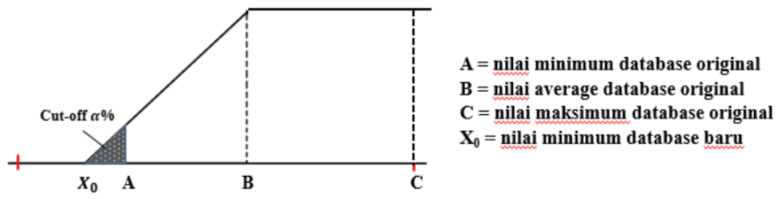
```
Langkah pertama dari algoritma adalah mencari nilai X~0~. Nilai X~0~ ditentukan sebagai berikut.
$$X_0 = \frac{-b\ ±\ \sqrt{D} }{2a}...(18)$$
Dimana: <br/> 
D = b^2^ - 4a <br/>
a = 1 - P <br/>
b = 2BP - 2A <br/>
c = A^2^ - 2PB^2^ <br/>
A = nilai minimum dari _database original_ <br/>
B = nilai rata-rata (*mean*) dari _database original_ <br/>
P = probabilitas nilai di x = _A_ (nyatakan P = $\frac{\alpha}{100}$). <br/>
Solusi X~0~ yang dipilih adalah yang memenuhi X~0~ < A.

Setelah nilai X~0~ diperoleh, maka langkah selanjutnya adalah menentukan probabilitas kecocokan. Probabilitas kecocokan suatu parameter input x terhadap _database_ (dinyatakan oleh P(*x*)) adalah sebagai berikut.

- Untuk parameter _input_ di bawah nilai _mean_ dari _database original_ (x < B)
```{r fig.align = 'center', out.width = "50%", fig.cap="Perhitungan P(x) untuk nilai input x < B"}
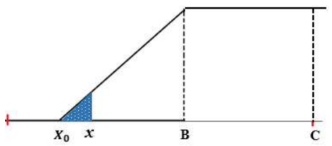
```
$$P(x) = \left[\frac{(x-X_0)^2}{(B-X_0)^2}\right] ...(19)$$
<p> &nbsp; </p>

- Untuk parameter _input_ di atas nilai _mean_ dari _database original_ (x < B)
```{r fig.align = 'center', out.width = "50%", fig.cap="Perhitungan P(x) untuk nilai input x > B"}
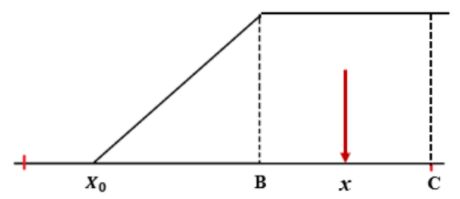
```
$$P(x) = 1...(17)$$
<p> &nbsp; </p>

#### Algoritma *Tight (Tight Screening Algorithm)*

Algoritma _tight_ diterapkan pada hasil (_score_) algoritma normal. Algoritma ini menerapkan prosedur tambahan dalam perhitungan dengan cara mempertimbangkan banyak dan besarnya nilai _unmatch_ dari score algoritma normal, sehingga metode EOR yang memiliki nilai _unmatch_ akan mengalami perubahan peringkat sesuai dengan banyaknya jumlah nilai _unmatch_ dan besarnya nilai _unmatch_.

Algoritma _tight_ diterapkan menggunakan sejumlah parameter berikut.
<center> __Average Match and Unmatch Score__ = $\frac{Total\ Match\ Score\ +\ Total\ Unmatch\ Score}{Number\ of\ Match\ +\ Number\ of\ Unmatch}$ </center>
<center> __Average Match Score__ = $\frac{Total\ Match\ Score}{Number\ of\ Match}$</center>
<center> __Ratio__ = $\frac{Average\ Match\ and\ Unmatch\ Score}{Average\ Match\ Score}$ </center>
<p> &nbsp; </p>

Score dari algoritma _tight screening_ dinyatakan oleh:
<center> __Tight Screening Score__ = __(Normal Screening Score)__ $\times$ Ratio ... (21)</center>
<p> &nbsp; </p>

#### Perhitungan Total Probabilitas Kecocokan

Total probabilitas kecocokan suatu metode EOR terhadap database dihitung menggunakan persamaan yang melibatkan hasil kali antara probabilitas kecocokan individu per parameter dengan nilai weighting factor. Persamaan ini berlaku baik pada algoritma statistik maupun algoritma teknik.
$$Probability\ (average\ score) = \frac{w_1F_1+w_2F_2+...+w_8F_8}{w_1+w_2+...+w_8}$$
$$Probability\ (average\ score) = \frac{\sum_{j=1}^{8}w_jF_j }{\sum_{j=1}^{8}w_j}...(22)$$
Dimana: <br/> 
_w~i~_ = _weighting factor_ parameter ke-*i* <br/>
_F~i~_ = parameter _input_ ke-*i* <br/>

Metode EOR dengan nilai probabilitas kecocokan terbesar terhadap database akan dipilih sebagai _the most probable EOR method_ bagi reservoir target tersebut.
<p> &nbsp; </p>

#### Algoritma _Penalty Factor_ Dalam EOR _Screening_ 

Dalam EOR _screening_, diterapkan algoritma tambahan untuk mengakomodasi _input_ _user_ yang berada di luar _database._ Algoritma ini disebut dengan algoritma _penalty_ _factor._ Algoritma _penalty_ _factor_ mengakomodasi seberapa jauh nilai _input_ _user_ yang berada di luar _database._ Maka, semakin jauh nilai _input_ _user_ dari _database_, nilai probabilitas total menjadi semakin kecil dan menurunkan peringkat metode EOR terkait dalam peringkat kecocokan. Algoritma _penalty_ _factor_ memberikan nilai kecocokan negatif.

Algoritma _penalty_ _factor_ diterapkan untuk setiap tipe algoritma _screening_ yang digunakan, termasuk algoritma screening tipe _average_, maksimum, dan minimum. Persamaan-persamaan yang digunakan untuk setiap algoritma adalah sebagai berikut.

__a.    Algoritma Tipe _Average___ <br/>
Untuk algoritma tipe _average_, _penalty factor_ diterapkan baik untuk kasus _input user_ di bawah minimum _database_ maupun untuk kasus _input user_ di atas maksimum _database_.
```{r fig.align = 'center', out.width = "50%", fig.cap="*Penalty factor* untuk algoritma tipe _average_"}
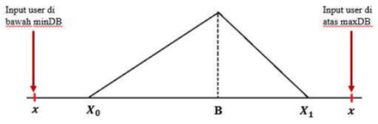
```
<p> &nbsp; </p>

Untuk nilai input > nilai maksimum _database_,
$$Penalty\ Factor\ = \frac{maxDB\ -\ nilai\ input}{maxDB\ -\ minDB}...(23)$$
Untuk nilai input < nilai minimum _database_,
$$Penalty\ Factor\ = \frac{nilai\ input\ -\ minDB}{maxDB\ -\ minDB}...(24)$$
<p> &nbsp; </p>

__b.    Algoritma Tipe Minimum <br/>
Untuk algoritma tipe minimum, _penalty factor_ diterapkan hanya untuk untuk kasus _input user_ yang berada di atas nilai maksimum _database_.
```{r fig.align = 'center', out.width = "50%", fig.cap="*Penalty factor* untuk algoritma tipe minimum"}
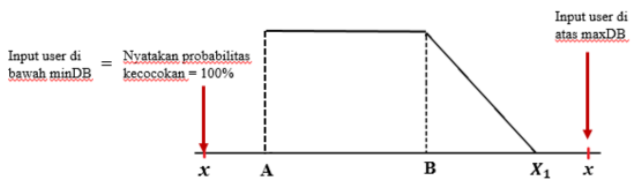
```
$$Penalty\ Factor\ = \frac{maxDB\ -\ nilai\ input}{maxDB\ -\ minDB}...(25)$$
<p> &nbsp; </p>

__b.    Algoritma Tipe Maksimum <br/>
Untuk algoritma tipe minimum, _penalty factor_ diterapkan hanya untuk untuk kasus _input user_ yang berada di bawah nilai maksimum _database_.
```{r fig.align = 'center', out.width = "50%", fig.cap="*Penalty factor* untuk algoritma tipe maksimum"}
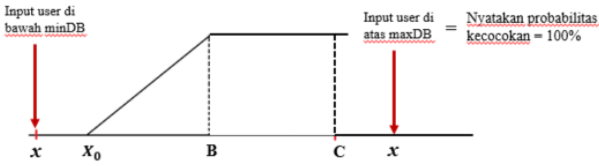
```
$$Penalty\ Factor\ = \frac{nilai\ input\ -\ minDB}{maxDB\ -\ minDB}...(26)$$

Sedangkan, untuk kasus _input_ distribusi, algoritma _penalty factor_ diterapkan sama seperti pada kasus _input single value_ untuk tipe algoritma _average_.
<p> &nbsp; </p>

### Metode Analisis EOR _Screening_ Untuk _Input_ Data Distribusi

Untuk kasus _input_ data distribusi, maka _input_ dari _user_ berupa parameter-parameter dari distribusi _input_, seperti _mean_, standard deviasi, nilai minimum, dan nilai maksimum. Pada kasus distribusi,terdapat dua jenis distribusi yang terlibat, yaitu __distribusi _database___ dan __distribusi _input___.

_Database_ yang digunakan adalah interval nilai dengan nilai minimum, nilai maksimum, dan nilai rata-rata, sehingga hanya ada tiga nilai yang diketahui. Oleh karena itu, pada penelitian ini,distribusi _database_ selalu diasumsikan mengikuti __distribusi _triangular_ (segitiga)__ dengan _density_ _function_ seperti yang dinyatakan dalam persamaan (6). Untuk distribusi _input_, _user_ dapat memilihempat pilihan distribusi, yaitu __distribusi segitiga, distribusi normal, distribusi uniform, dan distribusi log normal__. Probabilitas kecocokan distribusi input terhadap distribusi _database_ diperoleh dengan menghitung luas daerah irisan antara dua distribusi probabilitas ini. Gambar berikut memperlihatkan ide dari metode analisis yang digunakan untuk kasus _input_ distribusi.
```{r fig.align = 'center', out.width = "50%", fig.cap="Daerah irisan dari distribusi _input_ dan distribusi _database_"}
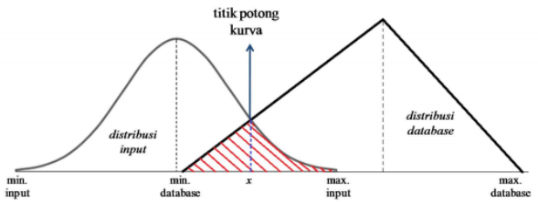
```

Bagian kurva yang diarsir dengan warna merah pada gambar di atas memperlihatkan contoh daerah irisan dari dua kurva distribusi, yaitu kurva distribusi _database_ (segitiga) dan kurva distribusi _input_ (normal). Titik potong kurva (x) dicari dengan menggunakan metode numerik Newton-Raphson. Setelah titik potong kurva diperoleh, luas daerah irisan dihitung menggunakan aturan Simpson, _seperti yang telah dijelaskan sebelumnya.

Berdasarkan penjelasan sebelumnya, maka terdapat empat kasus yang melibatkan pasangan distribusi database – distribusi input, yaitu: <br/>
(1) Kasus pasangan distribusi segitiga – distribusi segitiga <br/>
(2) Kasus pasangan distribusi segitiga – distribusi normal <br/>
(3) Kasus pasangan distribusi segitiga – distribusi uniform <br/>
(4) Kasus pasangan distribusi segitiga – distribusi log normal. <br/>
Secara umum, pengembangan algoritma untuk setiap pasangan distribusi _database_ distribusi _input_ dibagi ke dalam enam tipe algoritma yang berlaku untuk enam kasus berikut:

__(1) Distribusi _database_ dan distribusi _input_ tidak berpotongan___ <br/>
Distribusi _database_ dan distribusi _input_ tidak berpotongan jika interval distribusi _input_ berada di luar interval distribusi _database_. Gambar di bawah memperlihatkan contoh kasus ini untuk pasangan distribusi _database_ segitiga distribusi _input_ normal. Karena kedua kurva distribusi tidak berpotongan, maka tidak terdapat daerah irisan antara dua distribusi ini, sehingga probabilitas kecocokan distribusi input terhadap distribusi database adalah nol.
```{r fig.align = 'center', out.width = "50%", fig.cap="Distribusi _input_ dan distribusi _database_ tidak berpotongan"}
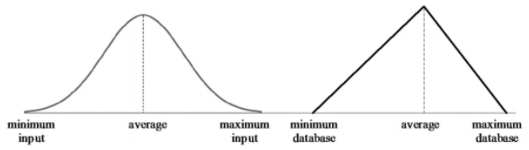
```
<p> &nbsp; </p>

__(2) Distribusi _database_ dan distribusi _input_ identik__ <br/>
Hal ini terjadi jika distribusi _database_ dan distribusi _input_ memiliki bentuk distribusi yang sama dengan parameter-parameter nilai minimum, nilai maksimum, nilai _mean_, dan nilai standard deviasi yang sama. Dengan kata lain, distribusi _database_ dan distribusi _input_ adalah dua distribusi identik. Karena dua distribusi identik, maka daerah irisan antara kedua distribusi ini meliputi seluruh daerah di bawah kurva kedua distribusi, sehingga probabilitas kecocokan distribusi _input_ terhadap distribusi _database_ adalah 100%.
```{r fig.align = 'center', out.width = "50%", fig.cap="Distribusi _input_ dan distribusi _database_ merupakan distribusi identik"}
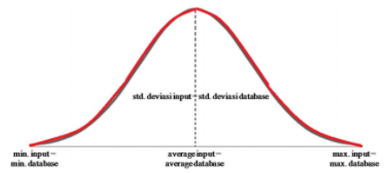
```
<p> &nbsp; </p>

__(3) Distribusi _input_ beririsan dengan distribusi _database_ di sisi kiri distribusi _database___ <br/>
Untuk kasus ini, terdapat satu titik potong antara kurva distribusi _database_ dan kurva distribusi _input._ Gambar di bawah memperlihatkan contoh untuk kasus ini.
```{r fig.align = 'center', out.width = "50%", fig.cap="Daerah irisan berada di sisi kiri kurva distribusi _database_"}
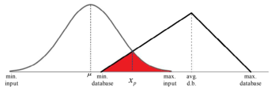
```

Pengembangan algoritma untuk kasus ini adalah sebagai berikut. Pertama, titik potong kurva dicari dengan menggunakan metode Newton. Fungsi yang digunakan dalam iterasi Newton adalah selisih antara kedua _density function_ dari distribusi _database_ dan distribusi _input._ Jika distribusi _database_ memiliki _density function f(x)_ dan distribusi _input_ memiliki _density function g(x)_, maka fungsi _h(x) = f(x) − g(x)_ menyatakan selisih dari fungsi distribusi _database_ dan fungsi distribusi _input._

Titik potong antara kedua kurva adalah suatu titik _x_ pada kurva dimana nilai fungsi _h(x)_ adalah nol. Nilai _h(x)_ nol adalah solusi eksak, sedangkan metode Newton adalah metode mencari solusi secara numerik. Oleh karena itu, dibutuhkan penyesuaian terhadap solusi numerik. Untuk solusi numerik, titik potong kurva dinyatakan oleh suatu titik _x_ pada kurva dimana nilai fungsi _h(x)_ sangat dekat dengan nol dengan tingkat kesalahan _E_. Tingkat kesalahan _E_ yang digunakan pada algoritma adalah 10^-7^. Sehingga, solusi titik potong x secara numerik adalah nilai dimana titik perulangan x~n+1~ memenuhi |_x~n+1~_ − _x~n~_| ≤ _E_.

Setelah titik potong kurva diperoleh, langkah selanjutnya adalah menghitung luas daerah irisan antara dua kurva distribusi. Luas daerah irisan ini diperlihatkan di gambar dengan arsiran merah. Luas daerah irisan menyatakan probabilitas kecocokan ditribusi _input_ terhadap distribusi _database_. Secara umum, untuk daerah irisan berada di sisi kiri kurva distribusi _database_, luas daerah dihitung dengan cara berikut. $$Luas\ Daerah\ arsiran\ = \int_{min.db}^{x_p}g(x)dx\ +\ \int_{x_p}^{max.input}f(x)dx...(27) $$
Dimana $\int_{min.db}^{x_p}g(x)dx$ dan $\int_{x_p}^{max.input}f(x)dx$ dihitung menggunakan aturan Simpson.
<p> &nbsp; </p>

__(4) Distribusi _input_ beririsan dengan distribusi _database_ di sisi kanan distribusi _database___ <br/>
Kasus ini masih melibatkan satu titik potong. Contoh kasus ini diperlihatkan pada hambar berikut.
```{r fig.align = 'center', out.width = "50%", fig.cap="Daerah irisan berada di sisi kanan kurva distribusi _database_"}
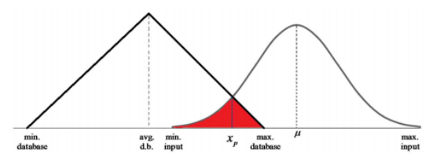
```

Langkah-langkah pengembangan algoritma untuk kasus ini sama seperti kasus (3) di atas, yaitu penentuan titik potong x~p~ yang diikuti oleh perhitungan luas daerah arsiran untuk mengetahui probabilitas kecocokan distribusi _input_ terhadap distribusi _database_. Secara umum, perhitungan luas daerah arsiran adalah: $$Luas\ daerah\ arsiran\ = \int_{min.input}^{x_p}g(x)dx\ +\ \int_{x_p}^{max.db}f(x)dx...(28) $$
Dimana $\int_{min.input}^{x_p}g(x)dx$ dan $\int_{x_p}^{max.db}f(x)dx$ dihitung menggunakan aturan Simpson.
<p> &nbsp; </p>

__(5) Interval distribusi _input_ berada di dalam interval distribusi _database___ <br/>
Berbeda dengan kasus (3) dan (4), kasus ini memiliki dua titik potong. Pada dasarnya, langkah-langkah pengembangan algoritma untuk dua titik potong sama seperti kasus satu titik potong, yaitu penentuan titik potong (dalam hal ini terdapat dua titik potong) kemudian menghitung luas daerah arsiran untuk mengetahui probabilitas kecocokan distribusi _inpu_. terhadap distribusi _database_.
```{r fig.align = 'center', out.width = "50%", fig.cap="Kasus interval distribusi _input_ berada di dalam distribusi _database_"}
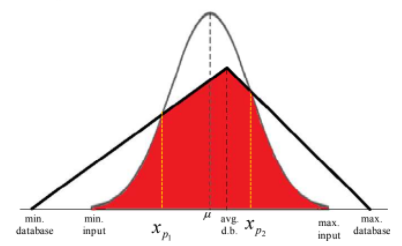
```
Luas daerah arsiran dihitung menggunkn persamaan berikut. $$Luas\ Daerah\ arsiran\ = \int_{min.input}^{x_{p_1}}g(x)dx\ +\ \int_{x_{p_1}}^{avg.db}f_1(x)dx\ +\ \int_{avg.db}^{x_{p_2}}f_2(x)dx\ +\ \int_{x_{p_2}}^{max.input}g(x)dx...(29)$$
Masing-masing integral di atas dihitung menggunakan aturan Simpson.
<p> &nbsp; </p>

__(6) Interval distribusi _databse_ berada di dalam interval dustribusi _input___
Sama seperti kasus (5), kasus ini melibatkan dua titik potong. Langkah-langkah pengembangan algoritma sama seperti kasus-kasus sebelumnya, yaitu penentuan titik potong yang dilanjutkan dengan perhitungan luas daerah arsiran untuk mengetahui probabilitas kecocokan distribusi _input_ terhadap distribusi _database_.
```{r fig.align = 'center', out.width = "50%", fig.cap="Kasus interval distribusi _database_ berada di dalam distribusi _input_"}
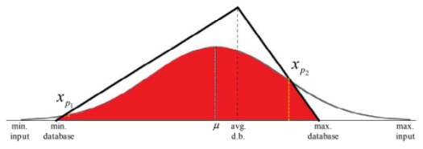
```
Luas daerah arsiran adalah: $$Luas\ daerah\ arsiran\ = \int_{min.input}^{x_{p_1}}f_1(x)dx\ +\ \int_{x_{p_1}}^{\mu}g(x)dx\ +\ \int_{\mu}^{x_{p_2}}g(x)dx\ +\ \int_{x_{p_2}}^{max.input}f_2(x)dx...(30)$$
Masing-masing integral di atas dihitung menggunakan aturan Simpson.

Masing-masing keenam kasus di atas berlaku untuk keempat pasangan distribusi _database_ – distribusi _input._ Langkah-langkah pengembangan algoritma adalah sama untuk setiap pasangan distribusi _database_ – distribusi _input._ Perbedaannya terletak pada fungsi _g(x)_ yang menyatakan _density_ _function_ dari distribusi _input._ Karena terdapat empat pilihan distribusi input, maka terdapat empat pilihan fungsi _g(x)_ yang berbeda bersesuaian dengan tipe distribusi _input_ yang dipilih oleh _user._ Secara umum, diagram alir algoritma untuk kasus input berupa distribusi diperlihatkan pada gambar berikut.

```{r fig.align = 'center', out.width = "75%", fig.cap="Diagram alir algoritma EOR _screening_ untuk kasus distribusi"}
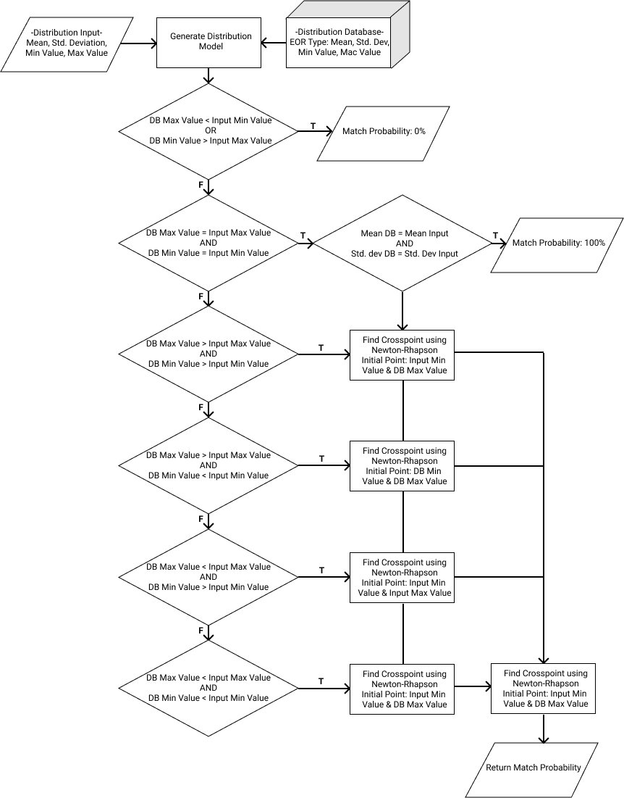
```